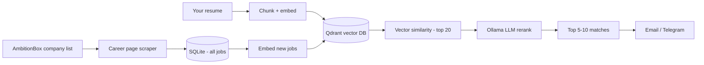

# Job Jarvios

**Personal AI career assistant** — an intelligent job discovery system that surfaces relevant opportunities matched to your resume, skills, and experience.

Job Jarvios collects postings from target company career pages, indexes them with vector search, ranks matches using a local LLM (RAG), and delivers a daily digest of the best-fit roles via email or Telegram.

Built as a portfolio project demonstrating web scraping, workflow automation, RAG, vector databases, and local LLM integration on a free, self-hosted stack.

---

## Branding

| Context | Name |
|---------|------|
| **Product / display name** | Job Jarvios |
| **GitHub repo / folder** | `job-jarvios` |
| **Python package** | `job_jarvios` |
| **Database file** | `job_jarvios.db` |
| **Tagline** | Personal AI career assistant |

Inspired by the idea of a personal assistant (J.A.R.V.I.S.) — built to help you find the right job, not just more jobs.
---

## Problem

Manual job hunting on Naukri, LinkedIn, and company career pages is slow and noisy. Most listings are irrelevant to your skills and experience. This project automates discovery and ranking so you apply to fewer, better-fit roles.

---

## Solution

```
Collect all jobs  →  Store in database  →  Match against resume  →  Alert top matches only
```

| Layer | Responsibility |
|-------|----------------|
| **Scrapers** | Collect companies and job postings (no filtering) |
| **Database** | Store companies, jobs, matches, and history |
| **AI / RAG** | Embed resume + jobs, vector similarity, LLM rerank |
| **Automation** | n8n daily cron pipeline |
| **Notifications** | Email / Telegram digest |

---

## Tech Stack

| Component | Tool | Cost |
|-----------|------|------|
| Language | Python 3.11+ | Free |
| API (later) | FastAPI | Free |
| Scraping | requests, BeautifulSoup | Free |
| LLM | Ollama (llama3.2) | Free |
| Embeddings | Ollama (nomic-embed-text) | Free |
| Vector DB | Qdrant | Free (Docker) |
| Database | SQLite → PostgreSQL | Free |
| Automation | n8n (self-hosted) | Free |
| Notifications | Gmail SMTP / Telegram Bot | Free |
| MCP (later) | Python MCP SDK | Free |

---

## Current Status

| Phase | Status | Notes |
|-------|--------|-------|
| Phase 0 — Setup | In progress | Basic scripts exist |
| Phase 1 — Company list | **Done** | ~5,700 companies in `data/companies.csv` |
| Phase 1 — Job scraping | Not started | Next step |
| Phase 2 — Resume + vectors | Not started | — |
| Phase 3 — RAG matching | Not started | — |
| Phase 4 — n8n automation | Not started | — |
| Phase 5 — Notifications | Not started | — |

---

## Project Structure

### Current layout

```
job-jarvios/
├── README.md
├── requirements.txt
├── scrape_ambitionbox_companies.py       # company list scraper
├── generate_project_plan.py              # generates Excel project plan
├── companies.csv                         # ~5,700 companies (move to data/)
└── Job_Jarvios_Project_Plan.xlsx         # detailed plan (if generated)
```

### Target layout (proper structure)

```
job-jarvios/
├── README.md
├── .env.example
├── requirements.txt
├── docker-compose.yml                    # n8n, Ollama, Qdrant
│
├── data/
│   ├── companies.csv                     # AmbitionBox company list
│   └── exports/                          # CSV exports, backups
│
├── db/
│   ├── schema.sql                        # companies, jobs, matches tables
│   └── job_jarvios.db                   # SQLite (gitignored)
│
├── scrapers/
│   ├── ambitionbox/
│   │   └── scrape_companies.py
│   └── careers/
│       ├── find_career_urls.py           # resolve career page per company
│       └── scrape_jobs.py                # extract job postings
│
├── app/
│   ├── config.py                         # env vars, paths
│   ├── models/                           # database models
│   └── services/
│       ├── ingest.py                     # save jobs to DB
│       ├── resume.py                     # parse + chunk resume
│       ├── embed.py                      # Ollama embeddings
│       ├── match.py                      # vector search + LLM rerank
│       └── notify.py                     # email / Telegram
│
├── app/api/                              # FastAPI (later)
│   └── main.py
│
├── mcp/                                  # MCP server (later)
│   └── server.py
│
├── n8n/
│   └── workflows/                        # exported n8n JSON workflows
│
├── scripts/
│   ├── run_daily_pipeline.py             # scrape → match → notify
│   └── seed_resume.py
│
├── tests/
│   └── test_match.py
│
└── docs/
    ├── architecture.md
    └── Job_Jarvios_Project_Plan.xlsx
```

---

## How It Works

### End-to-end pipeline



### Why save all jobs (not only relevant ones)?

The database stores **every** scraped job. Intelligence runs in a separate matching step:

1. **SQL filters** — location, experience band, role keywords (fast, cheap)
2. **Vector search** — resume embeddings vs job embeddings (semantic match)
3. **LLM rerank** — Ollama scores top candidates and explains fit

Irrelevant jobs stay in the DB but are never sent in alerts.

### Daily flow (n8n cron, 8:00 AM)

```
1. Scrape career pages for target companies
2. Insert new jobs into database (dedupe by URL)
3. Embed only new jobs → Qdrant
4. Vector search: resume vs recent jobs → top 20
5. Ollama rerank → top 5-10 with match score + reason
6. Send digest if score > 70
```

---

## Phases

### Phase 0 — Environment setup (Week 0)

- [x] Python scraper for AmbitionBox companies
- [ ] Reorganize into target folder structure
- [ ] Docker Compose: n8n, Ollama, Qdrant
- [ ] Pull Ollama models: `llama3.2`, `nomic-embed-text`
- [ ] `.env.example` for config

### Phase 1 — Data collection (Week 1)

- [x] Scrape filtered company list from AmbitionBox (~5,700 companies)
- [ ] SQLite schema: `companies`, `jobs`, `matches`
- [ ] Career page URL finder (start with top 20–50 companies)
- [ ] Career page job scraper (title, location, description, apply URL)
- [ ] Job deduplication by URL

**Done when:** 50+ real jobs from 10–20 companies stored in database.

### Phase 2 — Resume + vector search (Week 2)

- [ ] Resume input (PDF or plain text)
- [ ] Chunk resume: skills, experience, projects, education
- [ ] Generate embeddings via Ollama
- [ ] Qdrant collections: `resume_chunks`, `jobs`
- [ ] Basic similarity search: top 20 jobs per run

**Done when:** Running match returns ranked jobs based on resume.

### Phase 3 — RAG + LLM ranking (Week 3)

- [ ] Ollama prompt: score jobs 0–100, explain fit, list missing skills
- [ ] Filter: only jobs with score > 70
- [ ] Store match history in `matches` table

**Done when:** LLM returns explained, ranked top 5–10 jobs.

### Phase 4 — Automation (Week 3–4)

- [ ] `scripts/run_daily_pipeline.py` — full pipeline in one command
- [ ] n8n workflow: daily cron → scrape → match → notify
- [ ] Error handling and logging

**Done when:** Pipeline runs daily without manual intervention.

### Phase 5 — Notifications (Week 4)

- [ ] Email digest (Gmail SMTP)
- [ ] Telegram bot alerts (optional, free alternative to WhatsApp)

**Done when:** You receive a daily list of relevant jobs.

### Phase 6 — Portfolio (Week 4)

- [ ] README with architecture diagram
- [ ] Demo video (2–3 minutes)
- [ ] Resume / LinkedIn project bullets
- [ ] Public GitHub repo

### Phase 7 — Enhancements (Later)

- [ ] Ingest Naukri / LinkedIn job alert emails via IMAP
- [ ] FastAPI REST API (`GET /matches/today`, `POST /resume`)
- [ ] MCP server for chat-based job search
- [ ] Simple web dashboard (view matches, mark applied)

---

## Getting Started

### Prerequisites

- Python 3.11+
- Docker Desktop (for n8n, Ollama, Qdrant — later phases)

### Install Python dependencies

```bash
cd job-jarvios
pip install -r requirements.txt
```

### Scrape company list (already done)

```bash
python scrape_ambitionbox_companies.py
```

Output: `companies.csv` with columns `company_name`, `slug`, `rating`, `profile_url`.

### Generate project plan Excel

```bash
pip install openpyxl
python generate_project_plan.py
```

Output: `Job_Jarvios_Project_Plan.xlsx`

---

## Database Schema (planned)

```sql
-- companies
id, name, slug, profile_url, career_url, last_scraped_at

-- jobs
id, company_id, title, location, description, url, source, posted_at, scraped_at

-- resume_chunks
id, section, text, embedding_id

-- matches
id, job_id, score, llm_reason, matched_at, notified_at
```

---

## Configuration (planned `.env`)

```env
OLLAMA_BASE_URL=http://localhost:11434
OLLAMA_CHAT_MODEL=llama3.2
OLLAMA_EMBED_MODEL=nomic-embed-text
QDRANT_URL=http://localhost:6333
DATABASE_PATH=./db/job_jarvios.db
RESUME_PATH=./data/resume.txt
TELEGRAM_BOT_TOKEN=
GMAIL_USER=
GMAIL_APP_PASSWORD=
MATCH_SCORE_THRESHOLD=70
TARGET_LOCATIONS=Mumbai,Pune,Remote
```

---

## Design Decisions

| Decision | Choice | Reason |
|----------|--------|--------|
| Primary language | Python | Best for scraping, RAG, MCP |
| API framework | FastAPI (later) | Closest to Express for JSON APIs |
| Start with framework? | No — scripts first | Simpler for personal single-user use |
| Save all jobs? | Yes | Filter at match time, not scrape time |
| LLM | Ollama local | Free, private resume data |
| Job sources (v1) | Company career pages | More reliable than scraping Naukri/LinkedIn |
| Scale | Personal use only | Architecture allows growth later |

---

## Portfolio Value

This project demonstrates:

- Web scraping and data ingestion
- Database design and ETL pipelines
- Vector embeddings and semantic search
- RAG (Retrieval Augmented Generation)
- Local LLM integration (Ollama)
- Workflow automation (n8n)
- System design: collect → index → match → notify

---

## License

Personal project. Not for commercial redistribution of scraped data.

---

## Author

Omkar — [Job Jarvios](https://github.com/yourusername/job-jarvios): personal AI career assistant.
